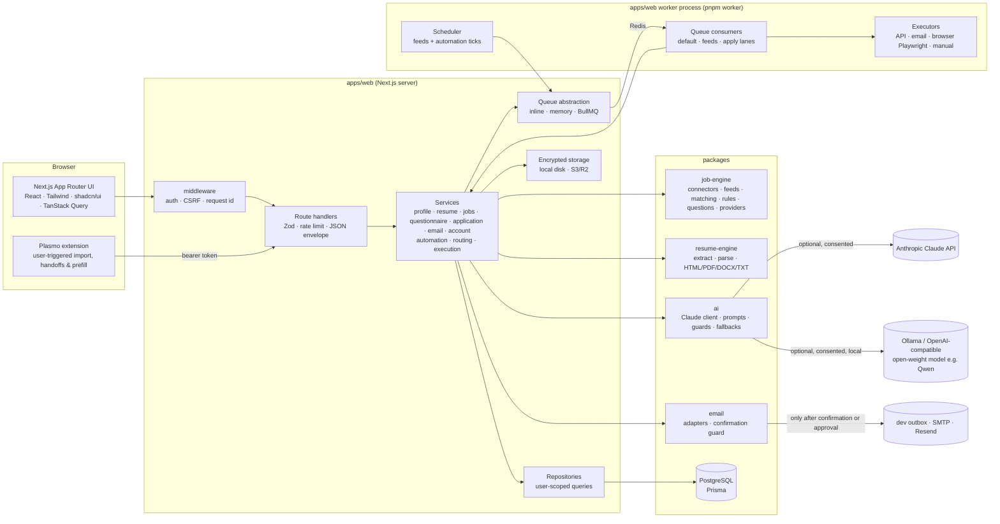

# ApplyWise

India-focused, **truthful** AI-assisted job discovery, matching and application orchestration platform (MVP).

Upload a CV, confirm which parsed facts are true, set your YOE, locations and work preferences, and get one inbox of jobs
ranked by a **transparent, deterministic "estimated resume-to-job match"**. For each job ApplyWise asks a few job-specific
questions, drafts a tailored resume, cover letter, screening answers and (for HR-email jobs) an application email — every
claim cites your own verified facts.

On top of that copilot, an optional **automation layer** keeps working in the backend: it discovers jobs from your
sources, matches them, applies your rules (ignore / recommend / review / auto-eligible), prepares applications from
verified data only, and routes them by the **application mode** you choose:

| Mode | What happens |
| --- | --- |
| **MANUAL** (default) | Discover, match and prepare. Nothing is ever submitted for you: you review and apply yourself, exactly like the copilot flow. |
| **REVIEW** | Prepared applications wait in a review queue; the ones you approve ("Approve & apply") are submitted where the provider supports it. |
| **AUTO** | Applications that meet every rule and safety check are submitted automatically where supported (standing `AUTO_APPLY` consent, unchanged rules and profile since the evaluation, daily limit, quiet hours, verified answers only - nothing drafted by the answer generator); everything else waits for you. |

**Honest limits.** LinkedIn, Naukri, Indeed, Foundit, Wellfound, Instahyre, Glassdoor, Cutshort, Hirist and Workday offer
no candidate-side application API and their terms forbid automation: their jobs arrive through the **job-alert emails**
you receive, and applying to them is always a **manual handoff** (prepared resume, cover letter and answers, the official
apply link, and optional extension prefill). ApplyWise never scrapes job sites, never stores job-platform passwords or
cookies, and never solves or bypasses CAPTCHAs, MFA or login walls — any of those ends in a handoff to you. Automatic
submission exists only for the fictional demo provider, email applications to an HR address (when you allow them, a
real email provider is configured and the job post asks for applications to that address), and — off by default and
experimental — a headless browser in the worker for Greenhouse / Lever / Ashby forms. Only content you (or your Auto
policy) approved is ever sent; editing it clears the approval. See
[docs/AUTOMATION_ARCHITECTURE.md](docs/AUTOMATION_ARCHITECTURE.md).

> The app name is configurable with `NEXT_PUBLIC_APP_NAME` (default `ApplyWise`).

## Architecture



| Path | What it is |
| --- | --- |
| `apps/web` | Next.js 15 app: UI, REST route handlers, services, repositories, queue, storage; `src/worker/main.ts` is the dedicated worker (queues + scheduler + health endpoint) |
| `apps/extension` | Plasmo MV3 extension: "Import this job", manual handoffs and "Prefill approved profile" (never submits) |
| `packages/types` | Shared domain types and enums (`automation.ts`: modes, decisions, capabilities, views) |
| `packages/validation` | Shared Zod schemas for every API input |
| `packages/database` | Prisma schema, migrations, seed, shared data helpers |
| `packages/job-engine` | Connectors, feeds, JD normaliser, skill taxonomy, deterministic matching, questionnaire rules, automation rules / question resolver / resume selection / status-email classifier, provider registry with capability metadata, demo provider |
| `packages/resume-engine` | PDF/DOCX text extraction, rule-based CV parser, ATS-readable HTML/PDF/DOCX/TXT export |
| `packages/ai` | Isolated AI client (Claude, Ollama, OpenAI-compatible), versioned prompts, structured-output schemas, claim validator, deterministic fallbacks, live eval script |
| `packages/email` | Email adapters (dev outbox, SMTP/Mailtrap/Mailpit, Resend) and the send-confirmation guard |
| `packages/mail-sources` | Read-only mailbox access for job alerts (IMAP, Gmail API, Microsoft) and the forwarding webhook helpers |
| `packages/ui` | shadcn/ui-style primitives |
| `packages/config` | Shared TypeScript and ESLint configuration |

**How to add API keys and run the app day to day: [docs/running-guide.md](docs/running-guide.md).**

More detail: [docs/architecture.md](docs/architecture.md) · [docs/AUTOMATION_ARCHITECTURE.md](docs/AUTOMATION_ARCHITECTURE.md) ·
[docs/api.md](docs/api.md) · [docs/job-sources.md](docs/job-sources.md) ·
[docs/privacy-and-compliance.md](docs/privacy-and-compliance.md) · [docs/platform-integration-policy.md](docs/platform-integration-policy.md) ·
[docs/setup.md](docs/setup.md) · [docs/implementation-plan.md](docs/implementation-plan.md) ·
[docs/AUTOMATION_GAP_ANALYSIS.md](docs/AUTOMATION_GAP_ANALYSIS.md)

## Prerequisites

- Node.js ≥ 20.11 (tested on Node 24) and pnpm 9 (`npm i -g pnpm@9`)
- Docker (for PostgreSQL, the optional Mailpit SMTP catcher and the optional Redis for BullMQ)
- Optional AI model: an Anthropic API key, **or** a free local open-weight model via [Ollama](https://ollama.com) (e.g. `ollama pull qwen2.5:7b`). Without either, everything runs on deterministic fallbacks.

## Quick start

```bash
pnpm install
cp .env.example .env
# Fill AUTH_SECRET, ENCRYPTION_KEY (32 bytes base64) and SIGNING_SECRET (>= 32 chars), e.g.:
#   node -e "console.log(require('crypto').randomBytes(32).toString('base64'))"
pnpm db:up          # postgres on localhost:5433 (+ mailpit on :8025)
pnpm db:migrate     # apply Prisma migrations
pnpm db:seed        # demo user (fictional), 32 demo jobs, resume variants, reusable answers, Auto-mode settings (automation off)
pnpm dev            # http://localhost:3000 - web app + in-process scheduler and queue (development)
```

Run the whole automation pipeline on fictional demo data (after `pnpm db:seed`, in a second terminal):

```bash
AI_DISABLED=true pnpm demo:automation     # Git Bash / macOS / Linux
```

```powershell
$env:AI_DISABLED = "true"; pnpm demo:automation; Remove-Item Env:AI_DISABLED    # PowerShell
```

It connects the demo provider (DEMO CONTENT: 110 fictional jobs plus 14 cross-provider duplicates) for the demo user,
turns the automation on and runs one pass through the real pipeline — sync, merge, deterministic matching, rules,
preparation from verified facts, routing, executors, simulated employer replies — and prints the run metrics, the
applications by status and the dashboard numbers. `AI_DISABLED=true` is recommended: with a local model the demo would
prepare dozens of applications through the model and take a very long time. Then sign in as the demo user and open
**Automation**, **Review** and **Applications**. Nothing leaves your machine; the demo provider only simulates the
remote side.

Dedicated worker (optional in development, required for production):

```bash
pnpm worker         # BullMQ consumers + scheduler; health: http://localhost:3200/health
```

`WORKER_ROLES` selects `worker` (consume the queues), `scheduler` (feeds + automation ticks) or both (default). A
separate worker only receives the web app's tasks with `QUEUE_DRIVER=bullmq` (memory queues are per process); in
development `pnpm dev` alone runs everything. Details: [docs/running-guide.md](docs/running-guide.md#4-automation-worker-and-demo).

## Demo account

| | |
| --- | --- |
| Email | `demo@applywise.test` |
| Password | `DemoPass2026!` |

The demo profile ("Aarav Mehta", **fictional**) is a frontend/full-stack developer with React + TypeScript, complex workflow
UI, video-timeline/canvas and chunked-upload experience, preferring Bengaluru and Remote - India. Two skills and one
achievement are intentionally left unverified so you can try the verification flow. All demo jobs, companies, URLs and
emails are fictional (`.test` / `.example` domains, or the local mock career pages under `/demo/ats/*`). The seed also
gives the demo user two labelled resume variants, two reusable answers, Auto-mode settings (automation **off** until
you run the demo or switch it on) and the `AUTO_APPLY` consent.

**Suggested demo workflow (copilot)**

1. Sign in → **Jobs**: filter/sort the 32 demo jobs; note the transparent score and disclaimer.
2. Open *Senior Frontend Engineer - Video Editor* → review the requirement matrix and score composition.
3. **Generate questions**, answer them (answering "No" is fine) → **Prepare application**.
4. Edit the summary/bullets, review cover letter & screening answers → **Review & approve**.
5. **Apply** tab → *Open official apply page* (a local mock ATS page) → *I submitted it myself*.
6. For an email job (*Frontend Developer (React)*): enable **Email sending** in Settings → Privacy (new accounts must first
   confirm their email address via the emailed link - the demo account is pre-confirmed), open the **Email** tab,
   **Preview final email**, inspect recipient/subject/body/attachments, tick the confirmation and send. In development the
   email is written to `.outbox/` (or Mailpit), never delivered.
7. Or create your own account and run onboarding with your CV.

**Suggested demo workflow (automation)**

1. Run `pnpm demo:automation` (above), or open **Automation** and press **Try the demo** (`POST /api/automation/demo`).
2. **Automation**: mode, thresholds, rules, daily limit, quiet hours, the auto-apply consent and the readiness list;
   **Automation → Runs**: per-provider counts and every decision of a run.
3. **Review**: applications waiting for approval, with match factors, rule reasons, the selected resume, answers and
   their sources; approve & apply, decline or skip. **Needs information**: answer once, reused afterwards.
4. **Applications**: applied, handed off (CAPTCHA / login / MFA / unsupported platform — with the handoff package) and
   employer responses (assessment, interview, offer, rejection) from the simulated status emails.
5. **Settings → Job sources**: provider cards with each capability's honest status on this server.

## Automatic job intake

Jobs arrive automatically: ApplyWise reads the job-alert emails Naukri, LinkedIn, Indeed, Foundit and others send you
(read-only, after you connect your mailbox), follows companies' public Greenhouse/Lever/Ashby/SmartRecruiters/Workable/
Recruitee job boards, and runs saved searches on Adzuna, Himalayas, Jobicy and The Muse. Matching jobs land in the inbox
with a daily notification. With automation on, each run syncs your sources and evaluates the new jobs; in MANUAL mode
you still review and apply yourself. No job site is scraped. See [docs/job-sources.md](docs/job-sources.md).

## Tests

```bash
pnpm lint          # ESLint (flat config) in every workspace
pnpm typecheck     # tsc --noEmit in every workspace (strict)
pnpm test          # Vitest unit + DB-backed integration tests (uses database applywise_unit)
pnpm test:e2e      # Playwright E2E against a production build (uses database applywise_e2e)
```

`pnpm test` includes the service-level automation acceptance test (`apps/web/test/automation-acceptance.test.ts`): a new
user is onboarded, the scheduler discovers 100+ demo jobs, merges duplicates, matches, applies the rules, prepares,
submits within the daily limit, stops at NEEDS_INFORMATION and MANUAL_ACTION_REQUIRED where it must, and never submits
twice — with the inline queue, no AI and no network. The E2E guard `07-no-auto-submit.spec.ts` checks that programmatic
submission exists only in the worker-side browser executor and never in the web UI, API routes or the extension.

Create the two test databases once:

```bash
docker exec -it $(docker compose ps -q postgres) psql -U applywise -c "CREATE DATABASE applywise_unit;" -c "CREATE DATABASE applywise_e2e;"
pnpm --filter @applywise/web e2e:install   # Playwright Chromium
```

Tips: `E2E_SKIP_BUILD=1 pnpm test:e2e` reuses an existing `.next` build; `E2E_QUEUE_DRIVER=memory` runs E2E through the
asynchronous in-process worker instead of the inline driver.

## Environment variables

See [`.env.example`](.env.example) (every variable is validated at start-up in `apps/web/src/env.ts`).

| Variable | Required | Description |
| --- | --- | --- |
| `DATABASE_URL` | yes | PostgreSQL connection string |
| `APP_URL` | yes | Public base URL (used for links and demo career pages) |
| `AUTH_SECRET` | yes | Auth.js JWT/cookie secret (≥ 32 chars) |
| `ENCRYPTION_KEY` | yes | 32-byte base64 key for AES-256-GCM encryption of resumes, extracted text and provider/mailbox credentials |
| `SIGNING_SECRET` | yes | HMAC secret (≥ 32 chars) for email-send confirmations and extension prefill codes |
| `NEXT_PUBLIC_APP_NAME` | no | Display name (default `ApplyWise`) |
| `STORAGE_DRIVER` | no | `local` (default) or `s3` (AWS S3, Cloudflare R2, MinIO via `S3_*`) |
| `STORAGE_LOCAL_DIR` / `S3_*` | no | Storage location / S3-compatible credentials |
| `MAX_UPLOAD_MB` | no | CV upload limit (default 5) |
| `MALWARE_SCANNER` | no | `none` (structural stub) or `clamav` (`CLAMAV_HOST`, `CLAMAV_PORT`) |
| `AI_PROVIDER` | no | `anthropic` (default), `ollama` (local model) or `openai_compatible` |
| `ANTHROPIC_API_KEY` | no | Enables Claude when `AI_PROVIDER=anthropic`; empty = deterministic fallbacks |
| `ANTHROPIC_MODEL` | no | Model ID (default `claude-opus-5`) |
| `ANTHROPIC_EFFORT` | no | `low`…`max` (default `medium`) |
| `ANTHROPIC_SERVER_FALLBACKS` | no | Server-side refusal fallbacks beta (default `true`) |
| `OLLAMA_BASE_URL`, `OLLAMA_MODEL`, `OLLAMA_NUM_CTX` | no | Ollama server (default `http://localhost:11434`), model (default `qwen2.5:7b`), context window (default 8192) |
| `OPENAI_COMPAT_BASE_URL`, `OPENAI_COMPAT_MODEL`, `OPENAI_COMPAT_API_KEY` | no | Any OpenAI-compatible server (vLLM, LM Studio, llama.cpp, hosted open models) |
| `AI_MAX_ATTEMPTS`, `AI_TIMEOUT_MS`, `AI_TEMPERATURE`, `AI_DISABLED` | no | Retries; request timeout (120 s Claude / 300 s local); local sampling temperature; force fallbacks |
| `QUEUE_DRIVER` | no | `inline`, `memory` (default) or `bullmq` (needs `REDIS_URL`; required for a separate worker) |
| `APPLYWISE_DISABLE_WORKER` | no | `true` on the production web process: Next.js only enqueues, the worker consumes |
| `EMAIL_PROVIDER` | no | `dev` (default, writes `EMAIL_OUTBOX_DIR`), `smtp` (`SMTP_*`, e.g. Mailpit/Mailtrap) or `resend` (`RESEND_API_KEY`) |
| `EMAIL_FROM` | no | Sender address for provider sending |
| `SMTP_DELIVERS_EXTERNALLY` | no | `true` only for a real relay (UI labels captured vs delivered mail) |
| `EXTENSION_ORIGINS` | no | Allowed extension origins (`chrome-extension://<id>`) for CORS |
| `RATE_LIMIT_ENABLED`, `LOG_LEVEL` | no | Rate limiting toggle; log level |
| `ENABLE_DEMO_ADMIN` | no | Enables `/admin/demo-data` in development (always off in production) |
| `FEEDS_SCHEDULER`, `FEEDS_TICK_SECONDS` | no | In-process job-source scheduler of the web server (`on`, 300 s) |
| `AUTOMATION_SCHEDULER`, `AUTOMATION_TICK_SECONDS` | no | In-process automation scheduler of the web server (`on`, 60 s); set both schedulers `off` on the web process when the worker runs them |
| `AUTOMATION_MAX_DAILY_LIMIT` | no | Upper bound for every user's daily application limit (default 50) |
| `AUTOMATION_MAX_JOBS_PER_RUN`, `AUTOMATION_MAX_PREPARE_PER_RUN` | no | Jobs evaluated (500) and applications prepared (25) per automation run |
| `APPLY_QUEUE_CONCURRENCY` | no | Concurrency of the BullMQ submission queue (default 2) |
| `DEMO_PROVIDER_ENABLED` | no | Fictional demo provider: unset = on outside production; `true` / `false` override |
| `BROWSER_EXECUTOR_ENABLED`, `BROWSER_EXECUTOR_PROVIDERS`, `BROWSER_EXECUTOR_DRY_RUN`, `BROWSER_EXECUTOR_HEADLESS`, `BROWSER_EXECUTOR_TIMEOUT_MS` | no | Headless-browser executor in the worker: off by default; providers `demo` (default) and experimental `greenhouse`, `lever`, `ashby`; dry run; headless; timeout (60 s) |
| `WORKER_HEALTH_PORT`, `WORKER_ROLES` | no | Worker health endpoint port (3200, `0` = off); worker roles (`worker,scheduler`) |
| `ENABLE_PARTNER_API`, `PARTNER_API_*`, `ENABLE_PARTNER_FEED`, `PARTNER_FEED_*`, `ENABLE_ATS_BOARD_APIS` | no | Disabled-by-default integration stubs (require partner approval) |

Job-source keys (`ADZUNA_*`, `GOOGLE_*`, `MICROSOFT_*`, `INBOUND_EMAIL_*`, …): [docs/job-sources.md](docs/job-sources.md).

## Browser extension

```bash
pnpm ext:build        # -> apps/extension/build/chrome-mv3-prod (load unpacked in chrome://extensions)
pnpm ext:dev          # development build with reload
```

Connect it with a token from **Settings → Integrations**. It imports the job you are viewing, lists your **manual
handoffs** (applications the automation handed back or you apply to yourself) and prefills the official form with the
fields you select. It never submits. See [apps/extension/README.md](apps/extension/README.md).

## Deployment guide (outline)

1. **Database**: managed PostgreSQL 16 (e.g. RDS, Neon, Supabase). Run `pnpm db:deploy` in your release step, before
   deploying the web app and the worker.
2. **Redis**: managed Redis for BullMQ (`QUEUE_DRIVER=bullmq`, `REDIS_URL`). Locally:
   `docker compose --profile queue up -d redis` (port 6379).
3. **Web**: deploy `apps/web` (Vercel, Render, Fly, ECS…). Build with `pnpm build`, then run it as an enqueue-only web
   process:
   ```bash
   QUEUE_DRIVER=bullmq REDIS_URL=redis://… FEEDS_SCHEDULER=off AUTOMATION_SCHEDULER=off APPLYWISE_DISABLE_WORKER=true pnpm start
   ```
   (`pnpm start` = `next start -p 3000` in `apps/web`.) Set all required env vars; use a secrets manager for
   `AUTH_SECRET`, `ENCRYPTION_KEY`, `SIGNING_SECRET`, `ANTHROPIC_API_KEY`.
4. **Worker**: one or more long-running processes from the same checkout and environment:
   ```bash
   QUEUE_DRIVER=bullmq REDIS_URL=redis://… WORKER_ROLES=worker,scheduler pnpm --filter @applywise/web worker
   ```
   Probe `GET http://<worker>:3200/health` (`WORKER_HEALTH_PORT`). Scheduler steps claim work atomically, so several
   workers are safe. Only if you enable the browser executor (`BROWSER_EXECUTOR_ENABLED=true`), install Chromium where
   the worker runs: `pnpm --filter @applywise/web exec playwright-core install --with-deps chromium`. Keep it off (or
   `BROWSER_EXECUTOR_DRY_RUN=true`) until you have validated it; the repository ships no container image.
5. **Storage**: `STORAGE_DRIVER=s3` with a private bucket (S3 or R2). Objects are already encrypted client-side; keep the
   bucket private and enable versioning/lifecycle rules per your retention policy.
6. **Email**: `EMAIL_PROVIDER=resend` or `smtp` with a verified sending domain (SPF/DKIM/DMARC). Automated email
   applications additionally need each user to allow them.
7. **Demo provider**: off in production unless `DEMO_PROVIDER_ENABLED=true`.
8. **Rate limiting**: replace the in-memory limiter with Redis when running multiple instances.
9. **Observability**: wire `reportError` (apps/web/src/server/logger.ts) to Sentry or similar; ship JSON logs.
10. **Extension**: set `host_permissions` / `EXTENSION_ORIGINS` for your production domain and publish to the Chrome Web Store.

## Known limitations

- **Real job-board APIs require partnerships/approval.** Naukri, Indeed, Instahyre and LinkedIn are not directly
  integrated; they are covered through the job-alert emails they send you, and applying to them is a manual handoff
  (`EXTERNAL_LIMITATION`). Official partner APIs/feeds remain disabled-by-default stubs (they need a partner agreement).
  Company job boards (Greenhouse, Lever, Ashby, SmartRecruiters, Workable, Recruitee) and job-search APIs (Adzuna,
  Himalayas, Jobicy, The Muse) run only for sources a user adds; see [docs/job-sources.md](docs/job-sources.md).
- **Automatic submission is narrow by design.** It works for the demo provider, for email applications to an HR address
  (opt-in, needs a delivering email provider and a job post that asks for applications to that address), and
  experimentally for Greenhouse / Lever / Ashby forms through the worker's headless browser (off by default, not
  validated against the live sites; the employers' official submission APIs need the employer's key). Everything else
  is prepared and handed to you (LinkedIn, Naukri, Indeed and the other job boards are `EXTERNAL_LIMITATION`).
  CAPTCHA, MFA, sign-in walls and unknown required questions always stop the automation.
- **Browser executor residual.** It only works on pages inside its adapter's URL allowlist and blocks navigations
  elsewhere, but an HTTP redirect target is fetched with a GET before the flow stops (nothing is read, filled or
  submitted there).
- **Profile values from the CV.** Years of experience, current title and current company parsed from your CV (only
  when you left them empty) are used in applications; check them in onboarding or on your profile (overlapping roles
  are merged before the years are summed). A job location that only says "Remote" is treated as "Remote - India", so
  country-less work-authorisation questions on such jobs are keyed to India (your India answer is used).
- **Demo provider state** (simulated retries and submissions) is kept in memory per process and resets on restart.
- **User-controlled browser import is used where APIs are unavailable.** The extension only reads the page you are viewing
  after you click, shows you the extracted data, and uploads only what you confirm.
- **MANUAL mode never submits, and the web UI / extension never submit.** Submissions happen only in the worker's
  execution service, only in REVIEW (after your approval) or AUTO (standing consent + every check), at most once per
  canonical job and within your daily limit. Email sending from the Email tab still requires a content-bound
  confirmation token plus explicit consent.
- **AI output requires human review.** Claude output is schema-validated and checked by a claim validator that rejects
  unsupported metrics, skills, employers and credentials, but every draft is still a proposal; AUTO approves only drafts
  with zero unsupported claims and no generated screening answers (a generated draft never answers a required
  question).
- **Employer-response tracking** reads emails that reach your private forwarding address (and the demo provider's
  simulated replies); connected IMAP / Gmail / Outlook mailboxes still download job-alert senders only.
- The Claude integration was implemented against the official SDK and type-checks, but automated tests run with the
  deterministic fallback (no API key in CI); run a manual smoke test with your key before relying on it.
- Local models (Ollama + Qwen 2.5 7B) were verified live with `pnpm --filter @applywise/ai eval`. They are slower (about
  20 tokens/s on a 6 GB laptop GPU) and weaker than Claude; outputs that fail the safety checks are repaired once and
  otherwise replaced by the deterministic drafts.
- Rate limiting is in-memory (single instance); the rule-based CV parser handles conventional single-column CVs best;
  DOCX export is supported, and there is no guarantee of ATS compatibility.
