# Automation architecture

ApplyWise evolves from "discover → match → prepare → review" into a configurable job discovery, matching and
application orchestration platform. The user configures it once; backend workers keep discovering, matching,
routing, preparing and (where supported and permitted) submitting applications. Nothing here replaces the existing
truth model, matching engine, AI layer, queue or state machine — each is extended.

Every account starts with automation **off** and in **MANUAL** mode, which behaves exactly like the original manual
flow: nothing is ever submitted for the user.

```mermaid
flowchart LR
  SCHED[Scheduler tick<br/>worker / instrumentation] -->|claim user lease| RUN[automation.run]
  RUN --> DISC[Discover<br/>claimDue feeds -> runSync]
  DISC --> NORM[Normalize + dedupe + merge<br/>persistNormalizedJob]
  NORM --> MATCH[Match<br/>computeMatchReport - deterministic]
  MATCH --> RULES[Rule engine<br/>IGNORE / RECOMMEND / REVIEW / AUTO_ELIGIBLE]
  RULES --> PREP[application.prepare<br/>resume selection, tailoring, cover letter,<br/>questions -> verified answers, truth validation]
  PREP --> ROUTE{Mode + safety checks}
  ROUTE -->|MANUAL| RFR[READY_FOR_REVIEW]
  ROUTE -->|REVIEW| WA[WAITING_APPROVAL] -->|user approves| APPR[APPROVED]
  ROUTE -->|AUTO, all checks pass| APPR
  ROUTE -->|unknown required answer| NI[NEEDS_INFORMATION]
  ROUTE -->|no executor| MAR[MANUAL_ACTION_REQUIRED<br/>manual handoff]
  APPR --> EXEC[application.execute<br/>approval + policy re-check,<br/>idempotency claim + daily-limit slot]
  EXEC -.->|policy approval blocked or stale| WA
  EXEC --> SEL{Executor}
  SEL -->|API| API[Demo provider / email]
  SEL -->|BROWSER| BR[Playwright + Chromium in worker]
  SEL -->|MANUAL| MAR
  API --> APPLIED[APPLIED]
  BR --> APPLIED
  BR -->|CAPTCHA / MFA / login| MAR
  MAR -.->|user applies, optional extension prefill| SUB[SUBMITTED]
  APPLIED --> TRACK[status sync + email tracking<br/>ASSESSMENT / INTERVIEW / OFFER / REJECTED]
```



## Components (where the code lives)

| Concern | Module | Notes |
| --- | --- | --- |
| Rule engine (pure) | `packages/job-engine/src/automation/rules.ts` | Deterministic (`rules-v1`); never recomputes the score |
| Question classifier + answer resolver (pure) | `packages/job-engine/src/automation/questions.ts` | Verified data only (`answers-v2`); work-authorisation / sponsorship keys carry a country (`countryForLocations`); unknown required → NEEDS_INFORMATION |
| Application-email detection (pure) | `packages/job-engine/src/automation/application-email.ts` | `applicationContactEmail` (HR address only from an application context) and `emailApplicationRequested` (send-time check) |
| Resume selection (pure) | `packages/job-engine/src/automation/resume-selection.ts` | Strongest verified evidence per resume variant (`resume-select-v1`) |
| Status-email classifier (pure) | `packages/job-engine/src/automation/email-status.ts` | Confirmation / recruiter reply / assessment / interview / rejection / offer (`status-email-v1`, min. confidence 0.7) |
| Provider abstraction + registry | `packages/job-engine/src/providers` (`types.ts`, `catalog.ts`, `registry.ts`, `routing.ts`) | Capability metadata per provider; wraps the existing feed adapters |
| Greenhouse application questions | `packages/job-engine/src/providers/greenhouse.ts` | Official public Job Board API (`?questions=true`); the only live question extraction |
| Demo provider (DEMO CONTENT) | `packages/job-engine/src/providers/demo.ts`, `packages/job-engine/src/demo/automation-jobs.ts` | 110 fictional jobs + 14 cross-provider duplicate listings, scripted outcomes |
| Settings / rules | `apps/web/src/server/services/automation-settings.service.ts` | Control centre, readiness checks, `ruleConfig()`, effective daily limit |
| Orchestrator | `apps/web/src/server/services/automation-orchestrator.service.ts` | Discovery → match → rules → prepare → route; scheduler tick; run metrics |
| Run history | `apps/web/src/server/services/automation-runs.service.ts` | `AutomationRun` counters (atomic increments) + `AutomationRunItem` |
| Preparation routing | `apps/web/src/server/services/application.service.ts` (`runPrepare`, `approveContent`, `applyNow`, `reviewQueue`, `handoff`) + `application-routing.service.ts` (`resolveQuestions`, `routeAfterPreparation`, `provideInformation`) | Resume selection, answers, truth validation, mode routing |
| State transitions | `apps/web/src/server/domain/application-state.ts` + `apps/web/src/server/services/application-transitions.ts` | Compare-and-set; every transition writes an `ApplicationEvent` with an actor |
| Execution | `apps/web/src/server/services/application-execution.service.ts` + `executors/*` | The only caller of an executor: idempotency, daily limit, leases, executor selection, crash recovery |
| Browser executor | `apps/web/src/server/services/executors/browser/*` | Playwright + Chromium (`playwright-core`), adapters `demo-ats`, `greenhouse`, `lever`, `ashby`; every page URL is checked against the adapter's allowlist |
| Daily limit + time | `apps/web/src/server/services/daily-limit.service.ts`, `automation-time.ts` | Atomic counter per user and local day; quiet hours |
| Provider connections | `apps/web/src/server/services/provider-connections.service.ts` | Encrypted tokens, expiry → NEEDS_ATTENTION |
| Job source cards | `apps/web/src/server/services/job-sources.service.ts` | Provider cards for Settings → Job sources |
| Reusable answers | `apps/web/src/server/services/candidate-answers.service.ts` | CandidateAnswer (user-authored) |
| Email status tracking | `apps/web/src/server/services/application-email-tracking.service.ts` | Reuses the forwarding webhook; metadata-only `ApplicationMessage` |
| Provider status sync | `apps/web/src/server/services/application-status-sync.service.ts` | `checkApplicationStatus` where a provider supports it (today: demo) |
| Notifications | `apps/web/src/server/services/notification.service.ts` | Dedupe keys, quiet hours |
| Dashboard | `apps/web/src/server/services/dashboard.service.ts` | `DashboardSummary` |
| Extension handoff | `apps/web/src/server/services/extension.service.ts` (`listHandoffs`, `PREFILL_STATUSES`) + `apps/extension/src/lib/handoff.ts` | Manual handoffs in the popup; prefill for handed-off applications (never while an automatic submission or retry is queued, `prefillBlockedReason`); still never submits |
| Demo | `apps/web/src/server/services/demo-automation.service.ts`, `apps/web/src/scripts/demo-automation.ts` | `POST /api/automation/demo`, `pnpm demo:automation` |
| Queue | `apps/web/src/server/queue` | Existing inline/memory/BullMQ drivers + new `apply` lane |
| Scheduler | `apps/web/src/server/scheduler.ts` (+ `instrumentation-node.ts` in the web server) | Feeds tick + automation tick |
| Worker process | `apps/web/src/worker/main.ts` | BullMQ consumers + scheduler + health endpoint |

## Application modes

| Mode | Discover | Match | Prepare | Submit |
| --- | --- | --- | --- | --- |
| MANUAL (default) | ✓ | ✓ | ✓ (REVIEW/AUTO_ELIGIBLE decisions) | never — READY_FOR_REVIEW, the user applies |
| REVIEW | ✓ | ✓ | ✓ | after the user approves (WAITING_APPROVAL → APPROVED → executor) |
| AUTO | ✓ | ✓ | ✓ | automatically only when every condition holds (below); otherwise WAITING_APPROVAL / NEEDS_INFORMATION / MANUAL_ACTION_REQUIRED |

AUTO submits only when: the rule decision is AUTO_ELIGIBLE and still current (the Auto rules - `rulesVersion` - are
unchanged since the evaluation, and the decision is not stale: `automationDecisionIsStale` treats it as stale when the
profile's `factsVersion` no longer matches the job's match score or the score was recomputed after `evaluatedAt`); the
user granted the `AUTO_APPLY` consent, automation is enabled and the mode is still Auto; the provider supports
submission and an automatic executor is available; every required question has a verified answer (a generated draft
never answers a required question) and no optional answer was drafted by the answer generator; truth validation passed
(no unsupported claims in the tailored resume or in the cover letter's cited claims); the daily limit is above 0 and
has a free slot; it is not quiet hours; and no manual challenge (CAPTCHA/MFA/login) is known.

When the application is routed after preparation (`policyBlockers`), the decision, automation, Auto mode, the consent,
the rules version, staleness, executor availability, the answers and truth validation are checked. When the execution
starts, `execute()` re-checks automation, Auto mode, the consent, the rules version, staleness and a daily limit above 0
for every policy approval. A blocked or stale policy approval is never left APPROVED: it goes back to
`WAITING_APPROVAL` (approval cleared) with a review notification. Quiet hours and the daily-limit slot are enforced by
the execution service, and a CAPTCHA, MFA prompt or sign-in wall met during execution ends in a manual handoff.

"Run now" (`POST /api/automation/run`) works even while the automation is off; the mode still decides whether anything
is submitted. The scheduler only runs enabled users.

## Rule engine

Inputs: the deterministic `JobMatchReport` (score, missing mandatory skills, location fit), the job, and the merged
`AutomationSettings` + `AutomationRule` configuration (`ruleConfig()`). Score routing: `< recommendScore` → IGNORE,
`< minMatchScore` → RECOMMEND, `< autoApplyScore` → REVIEW, else AUTO_ELIGIBLE (defaults 50 / 70 / 90). Checks then apply
effects. Combination: any IGNORE effect → IGNORE; otherwise the score decision, raised RECOMMEND → REVIEW by a preferred
company, then lowered to the lowest cap. The engine is pure (the clock is passed in as `ctx.now`), returns every check
with a plain-language detail, and at most five reasons for the final decision.

| Check (key) | Effect when it fails |
| --- | --- |
| match score below `recommendScore` (`match_score`) | IGNORE |
| excluded title word/phrase, whole-word match (`excluded_title`) | IGNORE |
| target titles set and the title matches none, directly or by role family (`target_title`) | cap RECOMMEND |
| excluded company; legal/generic suffixes ("Pvt Ltd", "India", "Technologies") ignored, containment match (`excluded_company`) | IGNORE |
| preferred company (`preferred_company`) | raise RECOMMEND → REVIEW (caps still apply) |
| required skills (`requiredSkillsMode` any/all) not listed by the job (`required_skills`) | IGNORE — but only cap REVIEW when the job is a description **snippet** (an alert rarely names every skill, so absence is unknown) |
| missing mandatory skill, unless `allowMissingMandatorySkills` (`mandatory_skills`) | cap REVIEW |
| job minimum − your YOE > `maxExperienceGapYears` (`experience`) | IGNORE; your YOE unknown → cap REVIEW |
| location with `locationMode=preferences` (`location`) | fit poor → IGNORE; fit unknown → cap REVIEW |
| work mode not in `allowedWorkModes` (`work_mode`) | IGNORE; the job's work mode unknown → cap REVIEW |
| salary (`salary`) | IGNORE only when the stated maximum is below `minSalary` in the same currency; another currency is not compared; no stated maximum passes |
| job age (`job_age`) | whole days elapsed since `postedAt` (else the time ApplyWise found it) > `maxJobAgeDays` → IGNORE; date missing or unparseable → cap REVIEW; a future date counts as today |
| source provider not in `enabledProviders` (empty = all) (`provider`) | IGNORE |
| apply method not in `allowedApplyMethods` (empty = all) (`apply_method`) | IGNORE |
| only a description snippet (alert email, Adzuna) (`description_level`) | cap REVIEW |
| already applied to the same canonical job — another application sent or being sent, or a SUCCEEDED execution (`already_applied`) | IGNORE |
| daily limit reached (`daily_limit`) | AUTO_ELIGIBLE kept with `deferredByDailyLimit`; the submission is deferred, never dropped |

Decision → application status: IGNORE → `REJECTED_BY_RULES`; RECOMMEND → `MATCHED` (shown, not prepared); REVIEW →
`MATCHED`, then prepared; AUTO_ELIGIBLE → `AUTO_ELIGIBLE`, then prepared. Preparation is capped per run
(`AUTOMATION_MAX_PREPARE_PER_RUN`, best scores first, one listing per canonical job, also across runs: a listing whose
sibling is already prepared or in progress is recorded as RECOMMEND); the rest is prepared by later runs.
Rule-rejected jobs can still be prepared by the user ("prepare anyway"). Pipeline applications are re-evaluated when
`rulesVersion` changes (any rule or threshold edit), when the match score was recomputed (profile facts or engine
version changed), or when they were never evaluated. Applications the user created, and applications that were already
prepared, are never touched by the orchestrator.

**Provider ids in rules.** The `provider` check and the review queue use `sourceProviderIdForJob`: the automatic
source's provider (`adzuna`, `greenhouse`, `demo`, …); for mailbox and forwarding sources the **platform named in the
alert** — a LinkedIn job-alert job is `linkedin`, not `job_alert_email` (that id is used only when the alert names no
known platform); otherwise the platform's provider. To stop automating LinkedIn-alert jobs, leave `linkedin` out of
`enabledProviders`. Run details and the Job sources cards group mailbox feeds under `job_alert_email`. The provider that
*submits* is resolved separately by `applicationProviderIdForJob` (demo → ATS host of the apply URL → `email_application`
for EMAIL jobs with an HR address → job-board host → search provider → the platform's provider → `career_site`).

## Application states

See `apps/web/src/server/domain/application-state.ts` (25 states, 22 actions). New: DISCOVERED, MATCHING, MATCHED,
REJECTED_BY_RULES, NEEDS_INFORMATION, WAITING_APPROVAL, AUTO_ELIGIBLE, APPLYING, APPLIED, FAILED, MANUAL_ACTION_REQUIRED,
ASSESSMENT. Existing states and the manual flow are unchanged. Every transition is compare-and-set
(`transitionApplication`) and writes an `ApplicationEvent` with an `actor` (user / system / policy / executor).
Invariants: `APPLIED` only from `APPLYING` (an executor holding the idempotency claim); `APPLYING` only from `APPROVED`
or a retry of `FAILED` / `MANUAL_ACTION_REQUIRED`, and only while the approval it was checked against is unchanged;
`APPROVED` only by the user or by `policy_approve` from `PREPARING`; `SUBMITTED` only by the user's "I submitted it
myself"; `EMAIL_SENT` only by the confirmed send endpoint; the manual tracker can never set APPROVED, APPLYING, APPLIED,
SUBMITTED, EMAIL_SENT or AUTO_ELIGIBLE. `decline` (→ WITHDRAWN) is available from every state before sending.

Approvals and retries:

- Every approval (the user's or the Auto policy's) stamps `Application.approvedAt`, and only approved content is ever
  submitted: `execute()` skips an application without `approvedAt`; every deferred task the execution service schedules
  (quiet hours, daily limit, retries, claim conflicts, crash recovery, reconnect) carries the approval stamp and is
  skipped when the approval changed; and the compare-and-set `APPROVED → APPLYING` also requires `approvedAt` to be
  unchanged.
- Editing the content (tailored resume, cover letter, screening answers) clears the approval: an APPROVED Review/Auto
  application returns to `WAITING_APPROVAL`, a FAILED / MANUAL_ACTION_REQUIRED one loses its approval and any scheduled
  automatic retry. Edits are refused while the application is PREPARING or APPLYING, once it was sent, and after an
  uncertain submission (check it first).
- In Review/Auto mode, approving (`POST /api/applications/[id]/approve`: the review queue, the application page or the
  handoff's **Review & approve**) queues the submission like "Approve & apply". FAILED and MANUAL_ACTION_REQUIRED
  applications can be approved (and queued) again, except after an uncertain submission.
- A user **Retry** (`POST /api/applications/[id]/apply` with `retry: true`) needs an approval of the current content and
  re-stamps `approvedAt`, which invalidates every older deferred task. When the last attempt ended
  `SUBMISSION_UNCERTAIN`, it also needs `acknowledgeUncertain: true` (the user checked that the application was not
  received); no automatic task touches such an application.

Routing after preparation (`routeAfterPreparation`):

| Condition | Result |
| --- | --- |
| User-created application without an automation mode (the original flow) | `READY_FOR_REVIEW` |
| MANUAL mode | `READY_FOR_REVIEW` + "ready for your review" notification |
| A required question has no verified answer (a generated draft does not count) | `NEEDS_INFORMATION` with `pendingQuestions`; answering resumes preparation |
| No automatic executor for this job | `MANUAL_ACTION_REQUIRED` with the reason (manual handoff). A provider connection that needs attention is not a handoff: routing continues and `execute()` holds the approved application until the user reconnects |
| AUTO + AUTO_ELIGIBLE + automation on + AUTO mode + `AUTO_APPLY` consent + unchanged `rulesVersion` + decision not stale + truth gate passed + no generated answers | `APPROVED` (`policy_approve`, `approvalSource = policy`) and `application.execute` queued |
| Anything else | `WAITING_APPROVAL` (the event lists the blockers) |

Answers (`resolveQuestions` + `resolveApplicationAnswers`, `answers-v2`):

- Standard fields, the job description's screening questions, the provider's form questions and the questions an
  executor found on the live form (`Application.runtimeQuestions`) are resolved from verified data first. Only open,
  non-sensitive questions without options may go to the guarded screening-answer generator (at most 8). A generated
  draft never resolves a REQUIRED question (the application goes to `NEEDS_INFORMATION`); an optional generated answer
  may be sent after review, but blocks the Auto policy approval (the application waits in `WAITING_APPROVAL`). The
  deterministic fallback never answers a yes/no or threshold question ("do you have…?", "at least 3 years of…?")
  affirmatively from facts that merely mention a skill.
- Work-authorisation and visa-sponsorship keys carry a country: the country the question names
  (`work_authorization:us`), else the job's country (`countryForLocations` over the job's locations: null for several
  countries, global/multi-country remote roles or unrecognised places). A phrase that is not a recognised place ("the
  country where this role is based") is never a country. When neither is known the key stays unqualified: an answer
  to it is stored for this application only even when "remember" is on (`provideInformation`), and reusable answers are
  never reused for such a question.
- A general "open to relocation" preference answers only relocation questions that name no place; "Yes" is never
  inferred for a named destination ("relocate to Pune?"). Current location is only ever the user's own answer: the
  profile source is empty (preferred locations are not the current city) and the payload's `applicant.location` is the
  user's resolved `current_location` answer.

Settings honoured for applications the automation created: with **Write a cover letter** (`generateCoverLetter`) off
no cover letter is generated, a letter left from an earlier preparation is deleted, and none is sent (payload or email
attachment). With **Tailor my resume for each job** (`tailorResume`) off the plan is still generated, but approval
freezes the selected resume version when the user approved it (never the raw `ORIGINAL` CV parse), otherwise a resume
built from verified facts only (`documentFromProfile`). The executor only ever renders an approved resume version
(`resumeFor`); without one the application is handed to the user (`UNSUPPORTED_FLOW`).

## Providers and capabilities

`JobProvider` (`packages/job-engine/src/providers/types.ts`): `discover`, `getDetails`, `normalize`,
`getApplicationRequirements`, `supportsApplication`, `submitApplication`, `checkApplicationStatus` — all optional;
`info(env)` reports each capability (DISCOVERY, DETAIL_FETCH, QUESTION_EXTRACTION, AUTO_APPLY, STATUS_TRACKING) as
AVAILABLE / LIMITED / NOT_CONFIGURED / SUPPORTED / EXPERIMENTAL / MANUAL / EXTERNAL_LIMITATION /
REQUIRES_EXTERNAL_CONFIGURATION / NOT_SUPPORTED, resolved against this server's environment
(`packages/job-engine/src/providers/catalog.ts`). A provider is `manualOnly` unless AUTO_APPLY is SUPPORTED or
EXPERIMENTAL.

| Provider (id) | Discovery | Detail fetch | Question extraction | Auto apply | Status tracking |
| --- | --- | --- | --- | --- | --- |
| LinkedIn, Indeed, Naukri, Foundit, Wellfound, Instahyre, Glassdoor, Cutshort, Hirist | LIMITED (job-alert emails) | MANUAL (extension import) | EXTERNAL_LIMITATION | EXTERNAL_LIMITATION (manual handoff) | LIMITED (forwarded employer emails) |
| Greenhouse | AVAILABLE (public job-board API) | AVAILABLE | AVAILABLE (Job Board API `questions=true`) | EXPERIMENTAL with `BROWSER_EXECUTOR_ENABLED=true` and `greenhouse` in `BROWSER_EXECUTOR_PROVIDERS`, else REQUIRES_EXTERNAL_CONFIGURATION | LIMITED |
| Lever, Ashby | AVAILABLE | AVAILABLE | NOT_SUPPORTED | as Greenhouse | LIMITED |
| SmartRecruiters, Workable, Recruitee | AVAILABLE | AVAILABLE | NOT_SUPPORTED | REQUIRES_EXTERNAL_CONFIGURATION (employer credentials) | LIMITED |
| Workday | NOT_SUPPORTED | MANUAL | EXTERNAL_LIMITATION | EXTERNAL_LIMITATION | LIMITED |
| Company career sites (`career_site`) | LIMITED (URL import, extension) | MANUAL | NOT_SUPPORTED | MANUAL | LIMITED |
| Himalayas, Jobicy, The Muse | AVAILABLE | AVAILABLE | NOT_SUPPORTED | MANUAL (provider's apply page) | LIMITED |
| Adzuna | AVAILABLE with `ADZUNA_APP_ID` + `ADZUNA_APP_KEY`, else NOT_CONFIGURED | LIMITED (snippets) / NOT_CONFIGURED | NOT_SUPPORTED | MANUAL | LIMITED |
| Job-alert emails (`job_alert_email`) | AVAILABLE (Gmail / Outlook / IMAP / forwarding) | LIMITED (alert summary) | NOT_SUPPORTED | NOT_SUPPORTED (discovery channel) | LIMITED (forwarding address only) |
| Email applications (`email_application`) | NOT_SUPPORTED | NOT_SUPPORTED | NOT_SUPPORTED | **SUPPORTED only with a delivering provider** (`EMAIL_PROVIDER=smtp` + `SMTP_HOST`, or `resend` + `RESEND_API_KEY`); LIMITED with the dev outbox (manual handoff) | LIMITED (forwarded replies) |
| Demo (`demo`, DEMO CONTENT) | AVAILABLE | AVAILABLE | AVAILABLE (simulated form) | SUPPORTED (simulated) | AVAILABLE (simulated) — every capability NOT_CONFIGURED when the demo provider is disabled |

Notes:

- Only Greenhouse (and the demo provider) extract application questions; for every other provider the questions come
  from the job description and the standard field set, and the browser executor stops at NEEDS_INFORMATION when a form
  shows a required field it cannot fill from verified data.
- Email applications are automatic only with a delivering email provider. With the dev outbox the capability is
  LIMITED and `selectExecutor` hands every email application to the user. With `EMAIL_PROVIDER=smtp` and
  `SMTP_DELIVERS_EXTERNALLY` not `true` the capability is still SUPPORTED but notes that a capturing server (Mailpit,
  Mailtrap) never reaches employers; in production such a non-delivering adapter is refused at send time (manual
  handoff), outside production the email is captured and the confirmation says "captured … not delivered".
- An email application is only sent when the job post itself asks for applications to that exact address
  (`emailApplicationRequested`, checked at send time). The job-description parser takes an HR address only from an
  application context (the "How to apply" section, or a sentence such as "send your CV to …"), never "the first
  address in the text", and rejects automated and non-recruiting addresses (noreply, alerts, fraud, privacy, security,
  support, accessibility, …).
- Status tracking today receives employer emails through the **private forwarding address** (signed inbound webhook)
  and, for the demo provider, through the simulated status API. Connected IMAP / Gmail / Outlook mailboxes still
  download only known job-alert senders, so employer replies in them are not read until the user forwards them.
- Auth modes: job boards and Workday `not_supported` (connections refused, passwords never stored); the demo provider
  `api_key`; everything else `none`. Only `api_key` / `oauth_token` providers use a `ProviderConnection` when submitting.

## Executors

`ApplicationExecutor` (`apps/web/src/server/services/executors/types.ts`). `selectExecutor()` is pure (provider support ×
operator flags × user settings × connection status); only `applicationExecutionService.execute` may run one.

| Channel (`supportsApplication`) | Executor id | Automatic when | Idempotent on retry |
| --- | --- | --- | --- |
| api | `api:<provider>` (today `api:demo`) | the provider implements `submitApplication`; for `api_key` / `oauth_token` providers the connection is CONNECTED (missing → LOGIN_REQUIRED handoff; NEEDS_ATTENTION / ERROR → an APPROVED application is held until the user reconnects, a retried one is handed back) | only `api:demo` (deduplicates on `payload.idempotencyKey`) |
| email | `api:email` | a delivering email provider (the `email_application` AUTO_APPLY capability is SUPPORTED, not the dev outbox), `allowEmailApplications` on, `EMAIL_SENDING` consent, verified account email, the job names an HR address; at send time the draft must be addressed to that address and the post must ask for applications to it | no |
| browser | `browser:demo-ats`, `browser:greenhouse`, `browser:lever`, `browser:ashby` | `BROWSER_EXECUTOR_ENABLED=true`, the provider is in `BROWSER_EXECUTOR_PROVIDERS` (default `demo`), and an adapter matches the apply URL (`demo-ats` only on the `APP_URL` origin under `/demo/ats/`) | no |
| manual / not supported | `manual` | never: MANUAL_ACTION_REQUIRED with a reason and the handoff package | (nothing is sent) |

Browser flow (`executors/browser/flow.ts`): open the apply page → check that the page is still on a URL the adapter
allows → stop on CAPTCHA, MFA or a sign-in form (manual handoff, never bypassed) → list the form fields → map each label
with `classifyQuestion` to the user's resolved answer for that exact question (a country-qualified key only matches the
same key), else verified applicant data, the approved cover letter or the resume PDF (a checkbox only for an explicit
yes/no answer, a select only for an exact option; current location only from the user's own answer) → any required
field without a value → NEEDS_INFORMATION (the questions are kept in `Application.runtimeQuestions` and resolved by the
next preparation, so the user's answers reach the payload) → fill → check for a challenge again → dry run stops here →
press the form's own submit button → wait for the provider's confirmation text. No confirmation → FAILED with
`submissionUncertain` (the user is asked to check). One browser and context per application, default user agent, no
stealth, no fingerprint spoofing, no proxy rotation; field values are never logged.

URL allowlist: the page URL is re-checked against the adapter's allowlist after every navigation, after listing the
fields, before each fill, before submit and after submit. Main-frame navigations to a URL off the allowlist (script
redirects, links, form posts) are blocked before the request is sent (`page.route`). A page that left the allowlist
before submit ends in an `UNSUPPORTED_FLOW` handoff (nothing was filled or submitted there); leaving it after submit is
FAILED with `submissionUncertain`. Residual: Playwright does not route HTTP 3xx redirects, so a redirect target off the
allowlist is fetched with a GET before the flow stops; nothing is read, filled or submitted there.

Execution outcomes:

| Executor result | What happens |
| --- | --- |
| SUBMITTED | `ApplicationExecution` SUCCEEDED (terminal) → `APPLIED`, notification, run counter, audit `application.submitted_by_executor` |
| MANUAL_ACTION_REQUIRED (CAPTCHA, MFA, LOGIN_REQUIRED, UNSUPPORTED_FLOW, PROVIDER_RESTRICTION, …) | daily-limit slot released → `MANUAL_ACTION_REQUIRED` + handoff notification |
| NEEDS_INFORMATION | slot released → `NEEDS_INFORMATION` with the form's questions added to `pendingQuestions` and `runtimeQuestions` |
| AUTH_FAILED | slot released; the connection moves to NEEDS_ATTENTION with one notification; LOGIN_REQUIRED handoff; nothing is retried until the user reconnects |
| FAILED, retryable, definitely not sent | slot released → `FAILED`; automatic retry up to 3 attempts (30 s, 60 s, …; moved to the end of quiet hours when it would fall inside them) |
| FAILED, possibly sent, non-idempotent executor | slot kept → `MANUAL_ACTION_REQUIRED` / `SUBMISSION_UNCERTAIN`; never resubmitted automatically: the attempt locks the canonical job for every listing, and only the user's explicit retry with `acknowledgeUncertain` lifts it |

Each outcome is written in one transaction, fenced on the attempt: the execution row, the application transition and
the daily-limit slot release commit together or not at all (a worker whose attempt was already recovered changes
nothing). Before the idempotency claim: a daily limit of 0 means no automatic submission (the application stays
APPROVED with an explicit "limit is 0" event; a policy approval goes back to `WAITING_APPROVAL`), and a provider
connection that needs attention pauses APPROVED applications (held with `LOGIN_REQUIRED`, no per-application "apply
manually" notice; reconnecting re-queues them via `resumePausedForProvider`). After the claim, an application without
an approved resume is handed to the user before the executor runs.

Where executors run: `application.execute` is the only task on the `apply` lane. With `QUEUE_DRIVER=bullmq` that is the
`applywise-apply` queue (concurrency `APPLY_QUEUE_CONCURRENCY`), consumed by the dedicated worker. With the memory driver
it is the in-process apply lane of the process that enqueued the task (the Next.js server in development). Chromium is
only needed where the apply lane runs, and only with `BROWSER_EXECUTOR_ENABLED=true`
(`pnpm --filter @applywise/web exec playwright-core install chromium`). Nothing ever runs in, or requires, the user's
browser.

## Idempotency and concurrency

- `Application @@unique([userId, jobId])`; the orchestrator creates applications with create-or-find on P2002.
- `ApplicationExecution.idempotencyKey = userId:canonicalJobKey` (unique) — the same canonical job (Job.matchKey,
  shared by merged cross-provider duplicates; `dedupe:<dedupeKey>` when there is no match key) is never submitted twice,
  whatever the number of Job rows, retries, workers or overlapping schedulers. SUCCEEDED is terminal. A second listing
  of an already-submitted job is declined ("Already applied via another listing").
- Status transitions are compare-and-set; APPROVED → APPLYING can only be won by one worker, and only while
  `approvedAt` is the approval the attempt was checked against.
- Leases: `AutomationSettings.runLeaseUntil` + `runLeaseRunId` (one run per user; the lease is owned by the run, claimed
  atomically with its owner, renewed after every feed sync, between stages and every 25 evaluated jobs / 10
  preparations, and released only by its owner; a run that lost the lease stops as "superseded"; 15 min without
  renewal = crashed or stalled), `JobFeed.nextSyncAt` (feed claims, 10 min), `ApplicationExecution.leaseUntil` (10 min;
  the executor is aborted a minute before it expires). RUNNING runs that no longer hold a live lease are closed as
  FAILED ("interrupted"). Crash recovery (`execution.recover`): an expired RUNNING execution that never reached
  APPLYING is re-queued; one that did is retried only when the executor is idempotent, otherwise it becomes
  MANUAL_ACTION_REQUIRED / SUBMISSION_UNCERTAIN; applications left in APPLYING without a RUNNING execution for longer
  than a lease are reconciled to what the execution recorded (unknown outcomes of non-idempotent executors →
  SUBMISSION_UNCERTAIN). A run also re-queues preparations stuck in PREPARING for more than 30 minutes.
- `SUBMISSION_UNCERTAIN` is a lock: no automatic task submits, re-routes or takes over the canonical job while an
  attempt may have reached the employer (another listing of the job is handed to the user instead); only the user's
  explicit retry with `acknowledgeUncertain` lifts it for that application's own attempt.
- One preparation per canonical job, across runs: a strong decision for a listing whose sibling listing is already
  prepared or in progress is recorded as RECOMMEND ("duplicate listing"). A claim held by another listing's live or
  interrupted attempt is retried after a lease (never inside quiet hours).
- Queue job ids (`dedupeKey`) for automation runs, preparations and executions (BullMQ `jobId`, memory-driver dedupe
  set; a key is freed once the task finished). Re-enqueues that may meet a still-retained task (retries, deferrals,
  claim conflicts, recovery, reconnects, redrives, lost-execution sweeps, re-approvals of handed-back applications and
  the user's retries) use suffixed keys (`application.execute:<id>:<suffix>`), so they are never dropped.
- Daily limit: `DailyApplicationCounter` conditional increment (`count < limit`, one UPDATE under the row lock), taken
  together with the attempt's `slotDay` in one transaction and released only when an attempt definitely did not submit.
- Legacy rows: the migration `20260927130000_automation_backfill` fills `Application.canonicalJobKey` and marks
  pre-automation screening drafts resolved only when the generator could confirm them; `applyNow` re-prepares an
  application that was never prepared by the automation before anything is submitted.
- Schema hardening: the migration `20260927140000_automation_hardening` adds `AutomationSettings.runLeaseRunId` (the
  run that owns the lease) and `Application.runtimeQuestions` (questions an executor found on the live form, merged
  into the next preparation so the user's answers reach the payload).

## Daily limit, quiet hours and notifications

- Effective limit = `min(maxApplicationsPerDay, AUTOMATION_MAX_DAILY_LIMIT)`; the day is the user's local day
  (`timezone`, default `Asia/Kolkata`). A full day defers the submission to the next local day (`nextActionAt`). A
  limit of 0 means nothing is submitted automatically, and the application says so instead of being deferred day after
  day.
- Quiet hours (minutes after local midnight, may wrap midnight) hold **policy** approvals until the quiet period ends;
  approvals the user gave explicitly ("Approve & apply", retry) are not held. Deferred times the execution service
  schedules (next day for the daily limit, retry backoff, claim conflicts, crash recovery) never fall inside quiet
  hours: they are moved to the end of the quiet period.
- Notifications go through `notificationService.notify`: a per-user `dedupeKey` makes retries idempotent, and during
  quiet hours they are stored with `scheduledFor` and released by `notification.dispatch` (only the daily summary,
  sent at the hour the user chose, bypasses quiet hours). Keys are per episode, so a retried task never repeats a
  notice while a new episode is announced again: manual handoffs per attempt, "ready for your review" per preparation,
  status changes per transition (provider status sync) or per message (status emails). The job-source notices (daily
  "new matches", Gmail forwarding confirmation, needs attention) and the per-application reminder
  (`applicationService.dispatchReminder`, deduplicated per reminder time) also go through the service: no direct
  notification writes remain.

## Queue tasks (workflow names → task names)

| Workflow | Task | Lane |
| --- | --- | --- |
| feeds.sync | `feeds.sync` (existing) | feeds |
| jobs.normalize | `job.normalize` (existing; normalisation runs on import) | default |
| jobs.match | `job.match` (existing; the orchestrator matches inline for the jobs of a run) | default |
| applications.evaluate | `application.evaluate` (re-evaluate one application, or resume after NEEDS_INFORMATION) | default |
| applications.prepare | `application.prepare` (existing, now routes by mode) | default |
| applications.execute | `application.execute` | apply |
| applications.status.sync | `application.status_sync` | default |
| notifications.dispatch | `notification.dispatch` | default |
| daily.summary | `summary.daily` | default |
| (orchestration) | `automation.run` / `execution.recover` | feeds / default |

Lanes: BullMQ queues `applywise` (concurrency 4), `applywise-feeds` (2) and `applywise-apply`
(`APPLY_QUEUE_CONCURRENCY`, default 2), each job with 3 attempts and exponential backoff. The memory driver keeps three
in-process lanes that run one task at a time each, so syncs and submissions never wait behind slow AI tasks.

## Recurring workflows (scheduler)

`apps/web/src/server/scheduler.ts` runs two loops. Every step only claims work atomically, so several instances (web
servers and workers) can run it at once without duplicating anything.

| Loop / step | Every | What it claims | Task (dedupe key) |
| --- | --- | --- | --- |
| Feeds tick | `FEEDS_TICK_SECONDS` (300) | Due feeds of users **without** automation enabled (automation users' feeds are synced inside their runs) | `feeds.sync` |
| Automation runs | `AUTOMATION_TICK_SECONDS` (60) | Closes interrupted runs (RUNNING longer than a lease without a live lease → FAILED "interrupted"), then up to 25 enabled users whose `nextRunAt` is due and whose run lease is free (the lease is claimed for the new run); schedules the next run after `searchFrequencyMinutes` | `automation.run` (`automation.run:<runId>`) |
| Deferred submissions | same tick | Up to 100 APPROVED REVIEW/AUTO applications whose `nextActionAt` (quiet hours, daily limit, retry) is due, each claimed by a compare-and-set on `nextActionAt` | `application.execute` (`…:redrive:<time>`) |
| Lost executions | same tick | Up to 100 APPROVED REVIEW/AUTO applications without `nextActionAt`, unchanged for 15 min, with no RUNNING or SUCCEEDED execution and no "execution blocked" event in the last 24 h (policy approvals included: `execute()` returns blocked ones to the user) | `application.execute` (`…:sweep:<15-min bucket>`) |
| Crash recovery | same tick | RUNNING executions with an expired lease, then applications left in APPLYING without a RUNNING execution | `execution.recover` |
| Notification release | same tick | Notifications held by quiet hours | `notification.dispatch` |
| Provider status sync | same tick | Up to 25 users with sent applications due for a check (every 6 h per application; demo jobs always due) | `application.status_sync` (per user per hour) |
| Daily summary | same tick | Enabled users whose local `dailySummaryHour` has passed, once per local day (`lastDailySummaryDay` claim); pages through every enabled user (500 per page) | `summary.daily` |

Each step of the automation tick is isolated (a failing step is counted in `failedSteps` and does not stop the others),
and one user's failure never stops the others. Within a run, a job that cannot be evaluated is skipped and counted as a
failure (five in a row fail the run). The in-process loop never overlaps itself: a tick that is still running makes
the next one skip. The feeds tick skips users with automation enabled (their automation run discovers); a feed sync
outside a run (Sync now, a new source, a forwarded alert) that finds new jobs brings the user's next automation run
forward to the next tick.
Strong-match notifications count only jobs that became REVIEW / AUTO_ELIGIBLE in that run, and a later re-preparation
of an application is not counted again on the run that created it.

## Worker process and roles

```bash
pnpm worker          # = pnpm --filter @applywise/web worker
                     #   node --conditions=react-server --import tsx src/worker/main.ts (loads the root .env)
```

- `WORKER_ROLES` (comma list, default `worker,scheduler`; unset, empty or blank means the default): `worker` consumes
  the three BullMQ queues (with the memory driver it only runs what this process enqueues itself); `scheduler` runs both
  loops above. The worker's scheduler role ignores `FEEDS_SCHEDULER` / `AUTOMATION_SCHEDULER` — those flags only
  control the in-process scheduler that `instrumentation-node.ts` starts in the web server (when either is `on` and
  `QUEUE_DRIVER` is not `inline`).
- Health: `GET http://localhost:$WORKER_HEALTH_PORT/health` (default 3200, `0` disables) returns
  `{ ok, roles, queueDriver, lanes, database, scheduler: { startedAt, lastFeedsTickAt, lastAutomationTickAt, lastError, lastAutomationResult } }`
  with status 200, or 503 when the database is unreachable.
- `SIGINT` / `SIGTERM` (graceful shutdown, at most 25 s, then a forced exit): close the health server, stop the
  scheduler (no new ticks; the tick in flight finishes), close the BullMQ workers (they stop taking jobs and wait for
  the active ones) and queues (`stopWorkers`), then disconnect Prisma. Work cut off by the grace period is recovered by
  the leases.

| Topology | Web process | Worker process |
| --- | --- | --- |
| Development (one process) | `pnpm dev`, `QUEUE_DRIVER=memory`; the in-process scheduler and lanes do everything | not needed |
| Production | `QUEUE_DRIVER=bullmq`, `REDIS_URL`, `FEEDS_SCHEDULER=off`, `AUTOMATION_SCHEDULER=off`, `APPLYWISE_DISABLE_WORKER=true` (only enqueues) | `QUEUE_DRIVER=bullmq`, `REDIS_URL`, `WORKER_ROLES=worker,scheduler` (one or more instances; Chromium installed if the browser executor is on) |

## Configuration

All variables except `WORKER_ROLES`, `APPLYWISE_DISABLE_WORKER` and the demo-script overrides are validated in
`apps/web/src/env.ts`.

| Variable | Default | Meaning |
| --- | --- | --- |
| `AUTOMATION_SCHEDULER` | `on` | In-process automation loop of the web server (`off` when the worker runs the scheduler) |
| `AUTOMATION_TICK_SECONDS` | `60` (15–3600) | Automation loop interval |
| `AUTOMATION_MAX_DAILY_LIMIT` | `50` (1–500) | Upper bound for every user's daily limit (higher values are rejected) |
| `AUTOMATION_MAX_JOBS_PER_RUN` | `500` (10–5000) | Jobs evaluated per run |
| `AUTOMATION_MAX_PREPARE_PER_RUN` | `25` (1–500) | Applications prepared per run (bounds AI cost) |
| `APPLY_QUEUE_CONCURRENCY` | `2` (1–32) | Concurrency of the BullMQ `applywise-apply` queue |
| `DEMO_PROVIDER_ENABLED` | unset | Unset: demo provider on outside production, off in production; `true` / `false` override |
| `BROWSER_EXECUTOR_ENABLED` | `false` | Allow the Playwright browser executor in the worker |
| `BROWSER_EXECUTOR_PROVIDERS` | `demo` | Providers it may run for; `greenhouse`, `lever`, `ashby` are EXPERIMENTAL |
| `BROWSER_EXECUTOR_DRY_RUN` | `false` | Fill forms but never press submit (ends in an UNSUPPORTED_FLOW handoff) |
| `BROWSER_EXECUTOR_HEADLESS` | `true` | `false` shows the browser window (local debugging) |
| `BROWSER_EXECUTOR_TIMEOUT_MS` | `60000` (5000–600000) | Navigation/action timeout and confirmation wait |
| `WORKER_HEALTH_PORT` | `3200` | Worker health endpoint port (`0` disables it) |
| `WORKER_ROLES` | `worker,scheduler` | Worker process roles (read by the worker only; empty = the default) |
| `APPLYWISE_DISABLE_WORKER` | unset | `true` on the web process: never start BullMQ consumers inside Next.js |
| `FEEDS_SCHEDULER`, `FEEDS_TICK_SECONDS` | `on`, `300` | In-process feeds loop of the web server |
| `QUEUE_DRIVER`, `REDIS_URL` | `memory` | `bullmq` + Redis for a separate worker |
| `DEMO_QUEUE_DRIVER`, `DEMO_EMAIL` | `inline`, `demo@applywise.test` | Overrides for `pnpm demo:automation` only (set in the shell, not in `.env`; empty = the default) |

## Security

Provider credentials are AES-256-GCM encrypted (`ProviderConnection.secretEnc`), decrypted only for the provider's own
API call, never returned to the client and never logged; job-platform passwords, cookies and browser sessions are never
requested or stored (`ProviderAuthType.SESSION_TOKEN` exists in the schema but is never written). No CAPTCHA/MFA/anti-bot
bypass, no stealth fingerprinting, no rate-limit circumvention, no LinkedIn automation. Status emails keep only a
message-id hash, the sender domain and a truncated subject. Logs never contain passwords, cookies, tokens, CV content or
answers. The E2E guard `apps/web/e2e/07-no-auto-submit.spec.ts` keeps programmatic submission confined to
`executors/browser/`: there the only click is the one in `PlaywrightSession.submit()` (the adapter's submit-button
selectors), the flow calls it exactly once and only after the challenge, missing-field and dry-run checks, and there is
no `requestSubmit`, synthetic event or key press. It also asserts that only the executor registry loads the browser
executor, only `playwright-driver.ts` loads Playwright, only the execution service runs executors, and the extension
never clicks or submits.

## Known limitations

- **HTTP-redirect residual (browser executor).** Main-frame navigations off the adapter's allowlist are blocked before
  the request is sent, but HTTP 3xx redirects are followed by the network stack: such a redirect target is fetched with
  a GET before the flow notices and stops. Nothing is read, filled or submitted there.
- **Parser-derived profile values.** Years of experience, current title and current company filled from the CV parse
  (only when the user left them empty) are used as profile values in answers and payloads. The user can edit them in
  onboarding and on the profile; the parser merges overlapping or back-to-back roles before summing the years.
- **Bare "Remote" means India.** A location that only says "Remote" is normalised to "Remote - India" app-wide (remote
  roles naming another country keep it), so country-less work-authorisation questions on such jobs are keyed to India.
- **Demo provider memory is per process.** Its simulated retry state and submitted-application memory are kept in
  memory per process: they reset on restart and are not shared between worker instances.
- **Experimental ATS adapters.** The Greenhouse / Lever / Ashby browser adapters are EXPERIMENTAL, off by default and
  not validated against the live sites.
- **Job boards.** Automatic applications on LinkedIn, Naukri, Indeed, Foundit, Wellfound, Instahyre, Glassdoor,
  Cutshort, Hirist and Workday are `EXTERNAL_LIMITATION`: always a manual handoff.
- **Tailoring base.** The tailored resume is built from the verified profile document (`documentFromProfile`), not from
  the selected resume variant, and the tailoring plan is generated even when tailoring is off.
