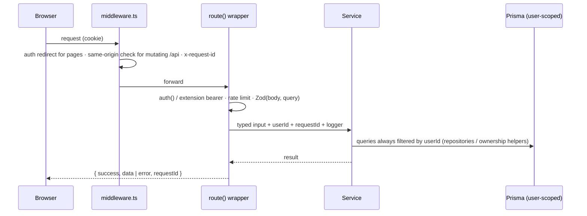
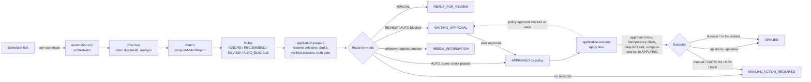
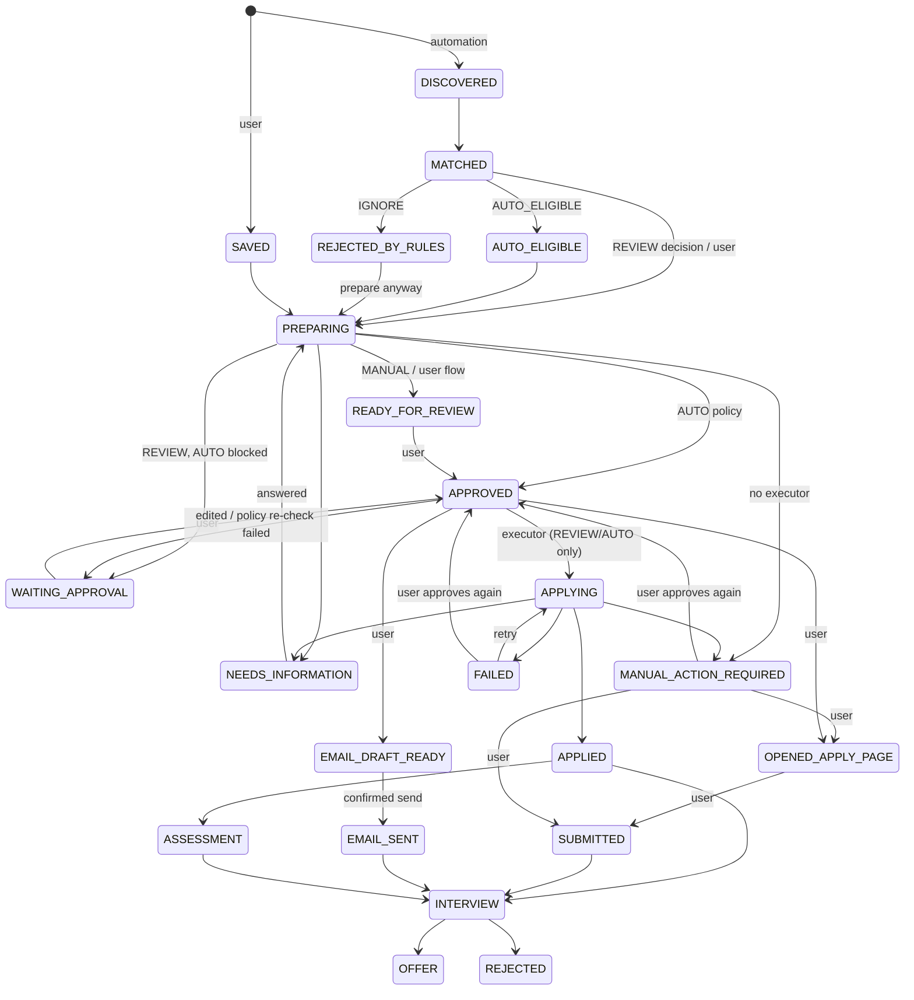
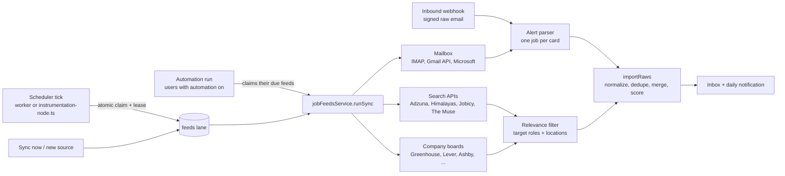
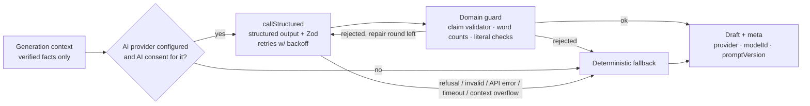

# Architecture

## Domain architecture

| Domain | Owner module | Key records |
| --- | --- | --- |
| Identity & consent | `server/services/auth.service.ts`, `consent.service.ts` | `User`, `UserConsent` |
| Candidate profile | `profile.service.ts`, `packages/database/src/profile-import.ts` | `CandidateProfile`, `CandidatePreference`, `TruthBankItem`, `Experience`, `Education`, `Project`, `CandidateSkill` |
| Resumes | `resume.service.ts`, `packages/resume-engine` | `Resume`, `ResumeParsedSection`, `ResumeVersion` |
| Jobs & sources | `jobs.service.ts`, `packages/job-engine/src/connectors` | `Job`, `JobSource`, `JobSkillRequirement`, `JobRequirement`, `JobContact`, `JobImportEvent`, `JobAnalysis`, `UserJobState` |
| Matching | `packages/job-engine/src/matching.ts`, `packages/database/src/candidate.ts` | `JobMatchScore`, `JobMatchFactor` |
| Questionnaires | `questionnaire.service.ts`, `packages/ai` | `JobQuestionnaire`, `JobQuestion`, `JobAnswer` |
| Applications | `application.service.ts`, `server/domain/application-state.ts` | `Application`, `ApplicationEvent`, `TailoredResume`, `CoverLetter`, `ScreeningAnswerDraft`, `ApplicationEmailDraft` |
| Email | `email.service.ts`, `packages/email` | `ApplicationEmailDraft` |
| Automation | `automation-orchestrator.service.ts`, `automation-settings.service.ts`, `application-routing.service.ts`, `packages/job-engine/src/automation` | `AutomationSettings`, `AutomationRule`, `AutomationRun`, `AutomationRunItem` |
| Execution | `application-execution.service.ts`, `executors/*`, `daily-limit.service.ts` | `ApplicationExecution`, `DailyApplicationCounter` |
| Providers | `packages/job-engine/src/providers`, `provider-connections.service.ts`, `job-sources.service.ts` | `ProviderConnection` |
| Answers & resumes | `candidate-answers.service.ts`, `resume-selection.service.ts` | `CandidateAnswer`, `Resume.label` / `targetRoles`, `Application.selectedResume*` |
| Status tracking | `application-email-tracking.service.ts`, `application-status-sync.service.ts` | `ApplicationMessage` |
| Platform | `audit.ts`, `queue/`, `scheduler.ts`, `worker/main.ts`, `notification.service.ts`, `extension.service.ts` | `AuditLog`, `Notification`, `BackgroundTask`, `ExtensionToken` |

Truth model: every parsed item starts as `PARSED_UNVERIFIED`. Only `USER_VERIFIED` / `USER_EDITED` facts count as
evidence or may be cited by generators. User-entered profile fields (YOE, title, notice period) are exposed to generators
as synthetic verified facts (`profile:yoe`, `profile:title`, `profile:notice`). Truthful positive questionnaire answers
become `QUESTIONNAIRE_ANSWER` facts; "No" never creates a fact, and "No" on an unverified CV claim rejects it. Reusable
application answers (`CandidateAnswer`: work authorisation, visa, current location, custom questions, …) are always
written by the user and are the only source for sensitive answers such as salary, notice period, work authorisation,
visa, relocation and start date (work-authorisation and sponsorship answers apply to one country; current location is
never taken from preferred locations).

## Request / data flow

- Every handler is wrapped by `route()` (`apps/web/src/server/http.ts`): authentication, rate limiting, Zod validation,
  the typed JSON envelope, and PII-safe error mapping (`AppError` → safe message; anything else → generic 500 + `reportError`).
- Pages call `requireUserId()` themselves because Next.js renders layouts and pages concurrently.
- Ownership: repositories query with `userId` in the `where` clause; shared catalogue jobs use `ownerUserId: null`.
  Non-owned resources always return 404 (no existence leaks).

## Background worker design

`apps/web/src/server/queue/index.ts` exposes `enqueue(name, payload, { userId, runAt, dedupeKey })`. Each task is
recorded in `BackgroundTask` (status, attempts, last error). A `dedupeKey` collapses a duplicate while the first task
is queued or running (BullMQ `jobId`; a dedupe set in the memory driver). Drivers:

| Driver | Use | Behaviour |
| --- | --- | --- |
| `inline` | tests, deterministic E2E, `pnpm demo:automation` | runs immediately and awaits (delayed tasks, e.g. retries, fall back to the in-process memory lanes); the in-process scheduler never starts |
| `memory` | development default | three in-process FIFO lanes with exponential-backoff retries (3 attempts); only the process that enqueued a task runs it |
| `bullmq` | production | Redis-backed BullMQ queues (`attempts: 3`, exponential backoff, delayed jobs), consumed by the dedicated worker |

Lanes keep slow work from blocking fast work: `default` (queue `applywise`, concurrency 4), `feeds` (`feeds.*` and
`automation.run`; queue `applywise-feeds`, 2) and `apply` (`application.execute` only; queue `applywise-apply`,
`APPLY_QUEUE_CONCURRENCY`, default 2).

Tasks: `cv.parse`, `job.normalize`, `job.match`, `application.prepare`, `email.draft`, `email.send`,
`email.verification` (the sign-up confirmation link, so a slow mail server never delays sign-up), `feeds.sync`,
`reminder.dispatch`, and for the automation `automation.run`, `application.evaluate`, `application.execute`,
`application.status_sync`, `notification.dispatch`, `summary.daily`, `execution.recover`. Handlers (`queue/handlers.ts`)
are thin and loaded lazily to avoid import cycles; all logic lives in the services. Batch preparation enqueues one
`application.prepare` per job (max 10) and the UI polls per-job status; user-started preparations land in
`READY_FOR_REVIEW`.

**Processes.** In development `pnpm dev` does everything: `instrumentation-node.ts` starts the in-process scheduler
(`apps/web/src/server/scheduler.ts`) when `FEEDS_SCHEDULER` or `AUTOMATION_SCHEDULER` is `on` and the driver is not
`inline`, and the memory lanes run the tasks. In production the dedicated worker (`pnpm worker`,
`apps/web/src/worker/main.ts`) consumes the BullMQ queues (`WORKER_ROLES=worker`) and runs the scheduler
(`WORKER_ROLES=scheduler`; empty means both), with a health endpoint on `WORKER_HEALTH_PORT`, and shuts down gracefully
on `SIGINT` / `SIGTERM` (scheduler stopped, BullMQ workers and queues closed, database disconnected, within 25 s); the
web process runs with
`QUEUE_DRIVER=bullmq`, `FEEDS_SCHEDULER=off`, `AUTOMATION_SCHEDULER=off` and `APPLYWISE_DISABLE_WORKER=true`, so it only
enqueues. Every scheduler step claims its work atomically (conditional updates and leases), so running it on several
instances is safe, only redundant.

**Recurring workflows.** Every `FEEDS_TICK_SECONDS` (300): due job sources of users without automation (automation users'
sources are synced inside their runs). Every `AUTOMATION_TICK_SECONDS` (60): interrupted runs are closed, due
automation runs (`automation.run`), deferred submissions whose time has come (quiet hours, daily limit, retries),
approved Review/Auto applications whose execute task was lost (re-queued under suffixed queue keys), crash recovery of
expired execution leases and of applications orphaned in `APPLYING` (`execution.recover`), release of quiet-hour
notifications (`notification.dispatch`), provider status sync for sent applications (`application.status_sync`) and
daily summaries for every enabled user (`summary.daily`). Each step is isolated, and a loop never overlaps itself
within a process. Details: [AUTOMATION_ARCHITECTURE.md](AUTOMATION_ARCHITECTURE.md#recurring-workflows-scheduler).

## Automation layer

The automation turns the manual copilot into a configurable pipeline that runs in the backend. Full design, rule table,
capability matrix and configuration: [AUTOMATION_ARCHITECTURE.md](AUTOMATION_ARCHITECTURE.md).

- **Orchestrator** (`automation-orchestrator.service.ts`): one run per user at a time. The lease
  (`AutomationSettings.runLeaseUntil`) is owned by the run (`runLeaseRunId`), renewed while it works and released only
  by its owner; a run that lost it stops, and stale RUNNING runs are closed as FAILED ("interrupted").
  Discovery claims the user's due feeds and calls the existing `jobFeedsService.runSync` (normalise, dedupe, merge),
  stale match scores are recomputed with the deterministic engine, the pure rule engine
  (`packages/job-engine/src/automation/rules.ts`) records a decision and its checks on the `Application`
  (`origin = AUTOMATION`; a job that cannot be evaluated is skipped, not fatal), and REVIEW / AUTO_ELIGIBLE jobs are
  prepared (capped per run, best scores first, one preparation per canonical job across runs). Every stage writes
  `AutomationRun` counters and `AutomationRunItem` rows; strong-match notifications count only newly strong jobs.
- **Rules**: thresholds (`recommendScore` / `minMatchScore` / `autoApplyScore`) route the score; filters (titles,
  companies, skills, experience, location, work mode, salary, job age, provider, apply method, description level,
  already applied, daily limit) ignore, cap, raise or defer. The engine never recomputes the score.
- **Preparation** (`applicationService.runPrepare`): automatic resume selection among the user's resume variants
  (verified evidence only, user override kept), the existing tailored-resume and cover-letter generators (no cover
  letter when the automation's "Write a cover letter" setting is off), question collection (job description, standard
  fields, provider form questions, and questions an executor found on the live form, `Application.runtimeQuestions`)
  and resolution from verified data (`resolveQuestions`), claim validation, then `routeAfterPreparation`. New drafts
  clear any earlier approval.
- **Providers and capabilities** (`packages/job-engine/src/providers`): one `JobProvider` per id with honest,
  environment-resolved capability statuses (LinkedIn, Naukri, Indeed and other boards are discovery-only via alerts
  and EXTERNAL_LIMITATION for applying).
- **Executors** (`executors/*`): API (`api:demo`, `api:email`), BROWSER (Playwright + Chromium in the worker, off by
  default, confined to the adapter's URL allowlist) and MANUAL (handoff). Only `applicationExecutionService.execute`
  runs them, and only for approved content (`approvedAt`; deferred tasks carry the approval stamp and are skipped when
  it changed). It re-checks Auto-policy approvals (automation on, Auto mode, `AUTO_APPLY` consent, unchanged
  `rulesVersion`, decision not stale, daily limit above 0; a failed check returns the application to
  `WAITING_APPROVAL`), then takes the idempotency claim on `userId:canonicalJobKey`, an atomic daily-limit reservation
  (`DailyApplicationCounter`) and the compare-and-set `APPROVED → APPLYING` transition (which also requires the
  approval to be unchanged). Each outcome (execution row, application transition, slot release) is written in one
  transaction. Crash recovery never resubmits blindly: an interrupted non-idempotent attempt becomes
  `MANUAL_ACTION_REQUIRED` / `SUBMISSION_UNCERTAIN`, a lock that only the user's acknowledged retry lifts, and
  applications orphaned in `APPLYING` are reconciled.
- **Tracking**: employer emails that reach the forwarding address are classified (metadata-only `ApplicationMessage`)
  and move sent applications to ASSESSMENT / INTERVIEW / OFFER / REJECTED; providers with `checkApplicationStatus`
  (the demo provider) are polled every 6 hours. Connected mailboxes still download only job-alert senders.
- **Schema**: the automation migrations are `20260927120000_automation_orchestration` (enums, tables, columns),
  `20260927130000_automation_backfill` (legacy canonical keys and screening drafts) and
  `20260927140000_automation_hardening` (`AutomationSettings.runLeaseRunId`, the run that owns the lease;
  `Application.runtimeQuestions`, questions an executor found on the live form, merged into the next preparation so
  the user's answers reach the payload).

### Extended state machine

`apps/web/src/server/domain/application-state.ts` (25 states). The manual flow is unchanged; every transition goes
through `transitionApplication` (compare-and-set, one event per transition with an `actor`: user, system, policy,
executor).

Not drawn: `MATCHING` (transient), `decline` → `WITHDRAWN` from every state before sending, the tracker's
`WITHDRAWN` / `EXPIRED` transitions, `MANUAL_ACTION_REQUIRED` → `APPLYING` (retry), and `FAILED` →
`OPENED_APPLY_PAGE` / `SUBMITTED` when the user applies after a failure. A retry needs an approval of the current
content (editing clears it) and, after `SUBMISSION_UNCERTAIN`, the user's acknowledgement that the application was not
received. `APPLIED` means an executor sent it; `SUBMITTED` and `EMAIL_SENT` keep meaning "the user sent it", so
provenance stays visible.

## Automatic job intake (feeds)

- Tables: `JobFeed` (per-user source, encrypted credentials, cursor, status/backoff), `JobFeedRun` (one row per sync),
  `Job.feedId` / `matchKey` / `descriptionLevel`.
- The scheduler claims due feeds with a conditional update (lease 10 min), so several app instances never sync the same
  source twice; crashed runs are retried when the lease expires. Failures back off exponentially; authentication
  failures move the source to `NEEDS_ATTENTION` and notify the user.
- For users with automation enabled the feeds tick skips their sources: each automation run claims and syncs them
  itself, so one driver produces accurate run metrics. A sync outside a run that finds new jobs (Sync now, a new
  source, a forwarded alert) makes the user's next automation run due immediately.
- The `DEMO` feed kind is the fictional demo provider (DEMO CONTENT): 110 jobs plus 14 cross-provider duplicate
  listings, imported through the same merge so the real pipeline runs on them.
- The memory queue driver has a separate lane for `feeds.*` tasks so syncs never wait behind slow AI tasks.
- `persistNormalizedJob` merges the same role found via several sources (title + company + primary city, 60-day
  window) and upgrades summary-only jobs when a full description arrives, then scores are recomputed.
- Demo jobs are hidden once the user has their own jobs (`CandidatePreference.showDemoJobs` overrides);
  `jobsSeenAt` drives the "new" badges.

## AI safety architecture

- Providers (`AI_PROVIDER`): `anthropic` (Claude via the official SDK), `ollama` (native `/api/chat` with a JSON Schema in
  `format` for grammar-constrained decoding and an explicit `num_ctx`), and `openai_compatible` (`/chat/completions` with
  `response_format: json_schema`). All three share one retry/validation loop; the schema is also stated in the system
  prompt for small models, output is JSON-parsed and Zod-validated, and truncation (`done_reason: length`) is retried with
  a "be more concise" note. Timed-out local generations are not retried (they would only time out again). For Ollama
  the prompt size is estimated against `num_ctx` before the call and `prompt_eval_count` is checked afterwards, so an
  over-long prompt fails with `context_overflow` (logged) instead of being silently truncated by the server.
- Guard-feedback repair: when a domain guard rejects an answer, the workflow is re-run once with the rejection reason
  (wrapped in a `<feedback>` data tag) appended to the prompt before falling back. The log line `ai.guard.rejected` has
  quoted fragments removed, so no CV text reaches the logs. Slightly short emails are topped up with fixed claim-free
  sentences, inserted only before a recognised sign-off.
- Deterministic sanitisers run on model output before the guards: questionnaires get the employer's screening questions
  verbatim (matched one-to-one), skill questions get canonical options whose "yes" values are the only answers recorded
  as facts, and tailored-resume bullets are re-homed to the role that owns the cited facts (cross-role rewrites are
  dropped). Original bullets without an accepted rewrite are always kept.
- All AI calls live in `packages/ai`. For Claude, `callStructured` uses `client.beta.messages.parse` with
  `output_config.format = betaZodOutputFormat(schema)`, the configurable model (`ANTHROPIC_MODEL`, default `claude-opus-5`),
  effort from `ANTHROPIC_EFFORT`, and server-side refusal fallbacks (`fallbacks: "default"`) unless disabled. It checks
  `stop_reason` (refusal / max_tokens), re-validates with Zod, retries retryable failures (429/5xx/connection/invalid
  output) with exponential backoff and jitter, and logs **only** safe metadata (workflow, prompt version, attempts, status).
- Prompts are versioned (`packages/ai/src/prompts.ts`); the prompt version and model ID are stored on every generated
  record. Untrusted content is wrapped in tags and treated as data.
- The claim validator (`guards/claim-validator.ts`) runs on every generated claim, including Claude's: claims must cite
  allowed verified fact ids; numbers, technologies, employers and credentials must appear in the cited facts; exaggerations
  are flagged. Unsupported bullets are removed and the summary is replaced with a conservative one.
- Parsers keep only literal values: e.g. AI-extracted emails/URLs that do not appear in the source text are dropped, and
  salary is kept only when the deterministic parser also found an explicit figure.
- Without `AI_PROCESSING` consent, `aiConfigFor(userId)` disables every AI provider for that user.
- The numeric match score is never produced by AI: it comes from `computeMatchReport` (rules only). The automation's
  rule decisions, resume selection, question classification and answer resolution are deterministic too.
- **Truth gate for automatic approval.** After preparation, `runPrepare` validates the tailored resume (summary and
  every proposed bullet) and the cover letter's cited claims (`validateClaims`, job company and title allowed as
  entities). Only when both have zero unsupported claims (`truthOk`) and no answer was drafted by the answer generator
  may AUTO mode approve by policy; otherwise the application waits for the user (`WAITING_APPROVAL`, the event names the
  reason). The review queue shows the unsupported-claim count.
- **Answers are resolved, not generated.** Application questions are answered first from verified profile fields and
  preferences, verified TruthBank facts and skills, previous questionnaire answers and the user's own `CandidateAnswer`
  rows (`resolveApplicationAnswers`, `answers-v2`). Only open, non-sensitive questions without options may fall back to
  the guarded screening-answer generator (at most 8 per application), and only an answer the generator can confirm from
  cited facts is used - as a suggestion: a generated draft never resolves a REQUIRED question (the application stops at
  `NEEDS_INFORMATION`), and an optional generated answer is sent only after the user's review (it blocks the AUTO
  policy). The deterministic fallback never answers a yes/no or threshold question affirmatively from facts that merely
  mention a skill. Sensitive questions (salary, notice period, work authorisation, visa, relocation, start date,
  diversity) are never generated. Work-authorisation and sponsorship keys carry a country (the one the question names,
  else the job's country from `countryForLocations`); when neither is known, the answer is stored for that application
  only and no reusable answer is used. A general "open to relocation" never answers "Yes" for a named destination, and
  current location comes only from the user's own answer. A required question without a verified answer is never sent:
  the application stops at `NEEDS_INFORMATION`, and the user's answer is stored for reuse. Executors receive resolved
  answers only.

## Matching engine

`packages/job-engine/src/matching.ts` (engine version stored with every score):

| Factor | Max | Rule summary |
| --- | --- | --- |
| Required-skill coverage | 35 | exact verified 100%, related 40%, unverified 20%, missing 0; mandatory weighted 1.5× |
| Evidence strength | 25 | experience 1.0 · project 0.8 · questionnaire 0.6 · skills list 0.35 · unverified 0 (related ×0.5) |
| Role & seniority | 15 | title family match (8) + YOE fit (7) |
| Domain relevance | 10 | overlap of job domains with verified experience text |
| Location / work mode | 10 | preferred city / remote (6) + work-mode compatibility (4) |
| Resume format | 5 | −1 per ATS-readability warning |
| Penalties | −25 max | −7 per missing mandatory skill, −4 per mandatory only matched by related/unverified evidence, −3/−8 YOE shortfall, −5 location conflict |

The skill taxonomy normalises synonyms (React.js/ReactJS → React, JS → JavaScript, Node → Node.js, RESTful APIs → REST API,
AWS S3 → Amazon S3, …) and supports admin-extensible aliases (`Skill` table, loaded at start-up).

## Resume / document pipeline

1. Upload → extension + MIME + magic-byte validation (PDF/DOCX only) → size limit → malware scan (stub or ClamAV).
2. Stored with an opaque generated key via `EncryptedStorage` (AES-256-GCM) over local disk or S3/R2.
3. `cv.parse` task: text extraction (pdf.js via `unpdf` with line reconstruction; DOCX via mammoth HTML to keep bullets) →
   the configured AI provider (with consent) or the rule-based parser → `applyParsedCv` stores unverified facts; extracted text and parsed
   sections are stored encrypted; an `ORIGINAL` `ResumeVersion` is created; ATS format warnings are computed.
4. Versions: `ORIGINAL`, `EDITED` (snapshot of verified profile), `TAILORED` (created on approval). Diffs are line-based.
5. Exports: ATS-readable single-column HTML, PDF (pdfkit, Helvetica, selectable text), DOCX (docx), plain text. Downloads
   only through authenticated endpoints; the PDF creation date is fixed per version so email attachments hash identically
   between preview and send.

## Email send guard

`preview` stores the edited draft, builds the exact outbound message (recipient, cc, subject, body, attachments) and returns
a 15-minute HMAC token bound to `userId`, `applicationId` and a SHA-256 digest of that content. Preview moves
`APPROVED → EMAIL_DRAFT_READY` compare-and-set before the draft changes (so it can never race an automatic submission)
and rejects an unapproved resume version as the attachment; the background send consumes the confirmed preview atomically and moves
`EMAIL_DRAFT_READY → EMAIL_SENT` compare-and-set, so an email is never sent twice. `send` requires the token,
`userConfirmed: true`, `consentToSend: true`, a confirmed account email (`User.emailVerifiedAt`, set via a 24-hour HMAC link
bound to the user id and address; the confirmed address is the reply-to), the stored `EMAIL_SENDING` consent and the
`EMAIL_DRAFT_READY` state; the
background send recomputes the digest and refuses on any change. `sendConfirmedEmail` in `packages/email` is the only
path for emails the user sends from the Email tab. The default provider (`dev`) never delivers mail.

Automated email applications (`api:email` executor, REVIEW / AUTO only) use `emailService.sendApplicationAutomatically`
with the same provider adapter, but no preview token: the confirmation is the user's approval (REVIEW, "Approve &
apply") or the AUTO policy under the standing `AUTO_APPLY` consent. It runs only inside the execution service while
the application is `APPLYING`, and re-checks at send time the `EMAIL_SENDING` consent, the confirmed sender address,
the REVIEW/AUTO mode, that the draft is addressed to the job's HR address, that the job post asks for applications to
exactly that address (`emailApplicationRequested`), that it was not sent before, and (in production) that the email
provider delivers externally. It requires `allowEmailApplications` (off by default) and a configured SMTP or Resend
provider: with the dev outbox the executor is not selected and the application is a manual handoff. The HR address
itself is only taken from an application context in the job post, never "the first address in the text". The event
and audit entry (`email.sent`, `automated: true`) record it, and the application ends in `APPLIED`, never `EMAIL_SENT`.

## Extension design

- MV3, popup only; permissions `activeTab`, `scripting`, `storage`; **no content scripts are registered**. Code runs in a
  page only via `chrome.scripting.executeScript` right after a click in the popup.
- `collectJobPage` reads visible text; the popup shows every extracted field for editing before "Confirm import"
  (`POST /api/jobs/import/browser`, `userConfirmed: true` required by the schema).
- Manual handoffs: when the popup opens (or on **Refresh**; it never polls) it calls `GET /api/extension/handoffs`
  with its bearer token. The list holds at most the 20 newest applications the user has to finish by hand:
  `MANUAL_ACTION_REQUIRED`, `FAILED`, `OPENED_APPLY_PAGE`, and `APPROVED` applications without an automation mode or in
  MANUAL mode. Excluded because an executor will still submit them: APPROVED applications in REVIEW / AUTO mode, and
  FAILED / MANUAL_ACTION_REQUIRED applications in REVIEW / AUTO mode with an automatic retry scheduled (`nextActionAt`
  set). Items
  contain only the job title, company, official apply URL and the reason - never tokens, CV text, answers or cover
  letters. "Open apply page" opens the official URL in a new tab on the user's click.
- Prefill: the user creates a 10-minute signed code in the web app for an application in `APPROVED` (manual flow only;
  approved REVIEW / AUTO applications are refused because they are queued for submission), `OPENED_APPLY_PAGE`,
  `MANUAL_ACTION_REQUIRED` or `FAILED` (`PREFILL_STATUSES`; a REVIEW / AUTO application with an automatic retry
  scheduled is refused too). `prefillBlockedReason` is checked when the code is issued and again when it is resolved.
  The extension resolves it with its bearer token, scans
  visible form labels (`collectFormFields`, never values), proposes a mapping (ATS adapters for
  Greenhouse/Lever/Workday/Ashby, generic label/placeholder/name matching otherwise, screening answers matched by their
  question text), shows the list, and fills only the selected fields (`applyFills`). The payload
  holds profile fields, the prepared cover letter and only resolved answers backed by verified data or written by the
  user; content not reviewed yet starts unselected, and unanswered questions are listed for the user to answer on the
  page. File, password, hidden, checkbox and button elements are never touched; there is no submit or click anywhere in
  the extension (enforced by ESLint rules and tests). The extension never solves CAPTCHAs or signs in; the handoff
  exists precisely so the user does those steps.
